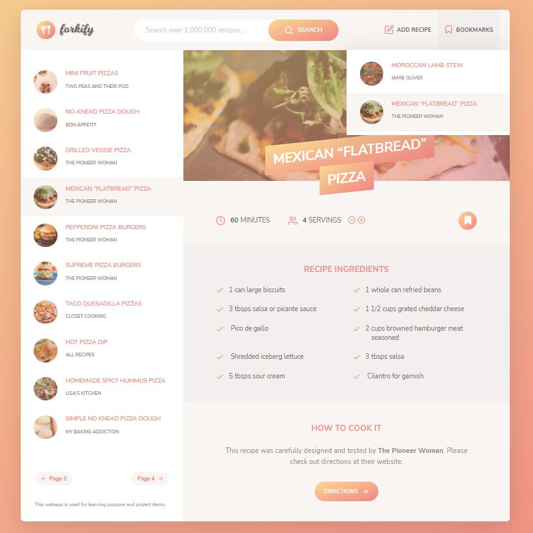
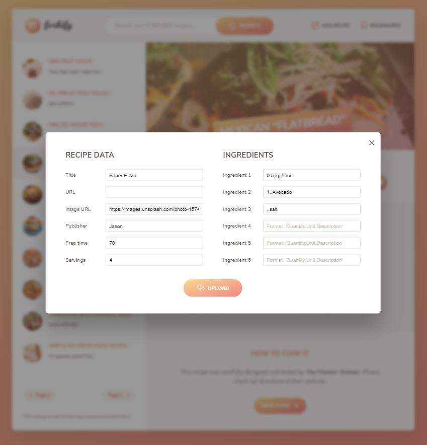

# Forkify - A Recipe Finding Web app

# Link

https://forkify-gcgogo22.netlify.app/ (Please try it out!)

# Technology used

- JavaScript ES6+ core features such as Class declearation, inheritance, Promise, Async/Await funcitons
- NPM package manager
- Parcle 2.0+ for bundling the applicaiton
- Model-View-Controller (MVC) architecture
- Publisher/Subsciber pattern

# Description

Forkify is a recipe finding web application which uses data from the Forkify API (https://forkify-api.herokuapp.com/v2). This app provided a search funciton that can be used as a guide to find cooking recipes among over 1 million. Beyond accessing recipes from different sources online, it also provides information on the number and amount of ingredients needed to build a specific dish according to the number of people to serve. Users can bookmark their favourite recipes, and they can also add their own recipes in the app.

# Flow-chart

# Screen shots

